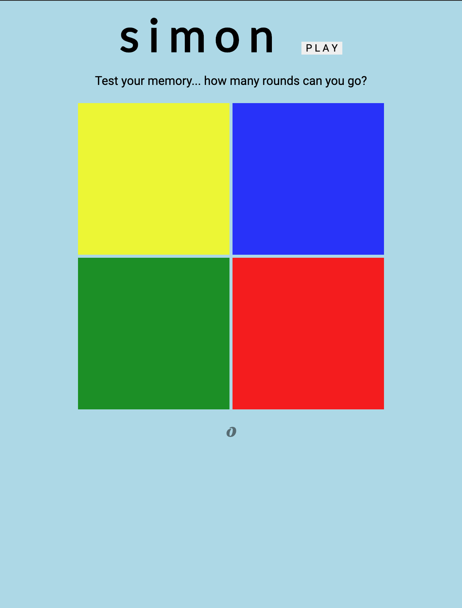
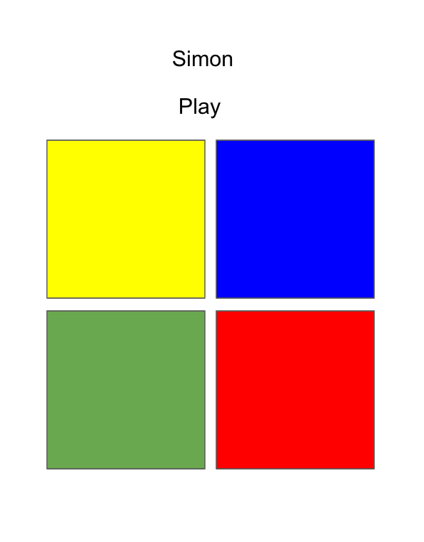

# SIMON

## Screens

## Technologies Used 

HTML // CSS // Vanilla Javascript ES6

## Installation Instructions 

## User Stories 
### MVP

- As a user, I want to be able to start the game.  

        // On window load, display the game squares and their intial color. Display start button underneath. 

- As a user, I want to be able to watch a sequence of "simon" generated randomly by the computer. 

        // When the start button is clicked, the program's randomly generated output. 

- As a user, I want to be able to see which boxes / colors the computer is selecting. 

// The first round can be four. The computer will generate a random array of strings, the length of which will be determined by the round, or, in later iterations, a difficulty selector. 

        // The current square's classes will toggle appropriately. 

- As a user, I want to be notified when it is my turn to click the boxes in the same sequence as the computers'. 

        // First iteration; a header perhaps ontop up the game boards will display; the user then can click the boxes and attempt to match the program's output. Each click on a div will push that div's ID to a user generated array. 

- As a user, I want to be notified immediately if I have failed to match the computer's output. 

        // If one index of the User array fails to match the index of the computer's array, the user has failed. The game stops and the user is asked to play again. 

- As a user, I want to be notified if I have gotten the sequence correctly. 

        // If the user generated array matches the computer generated array, the user has finished the round; when this happens, immediately after the last div clicked, the computer should pause the game and notify the user. A similar modal as the first round. 

- As a user, I want to be able to proceed to the next round if I have completed the first round. 

        // After the user has 'won' the round, they can choose to continue on to the second round, where the randomly generated array increases so-and-so amount. 

- As a user, I want the second, third, and so forth rounds to get increasing difficult; ie, the length of the sequence. 

        // In each successive round, the program's array increases, there by increasing how many div.classList toggles happen. 

- As a user, I want to know how many round I have successfully completed. 

        // A counter in the top right corner of the screen will display the count. 

### Silver

- As a user, I would like to be able to select which round before playing, or how difficult it would be. 

        //On window load,next to start button, a drop down indiciating difficulty. 

- As a user, I would like to be able to hear the game, to hear each button as a distinctive entity. 

        // Attach a unique tonal quality to each button that plays when either the program clicks' it or the user clicks it. 

### Gold 

- As a user, I would like to be able to watch an animation when the button is clicked; flashing, easing, something like that. 

## Wireframes 

## Hurdles 

-- Creating the comparison algorithm / logic, and the drawing of computer rounds using setTimeout was probably the most difficult hurdle. Unfortuantely, setTimeout is not always 100% reliable, and having two functions ping pong back and forth sometimes leads to stuttered timing effects, both in the activation of buttons and the playing of the sound associated with the button.  

-- In the future, it would be cool to implement a, start at round X function. 

-- In the future, it would be cool to dynamically create the buttons, so that a user could request a board size larger than 4 x 4. 